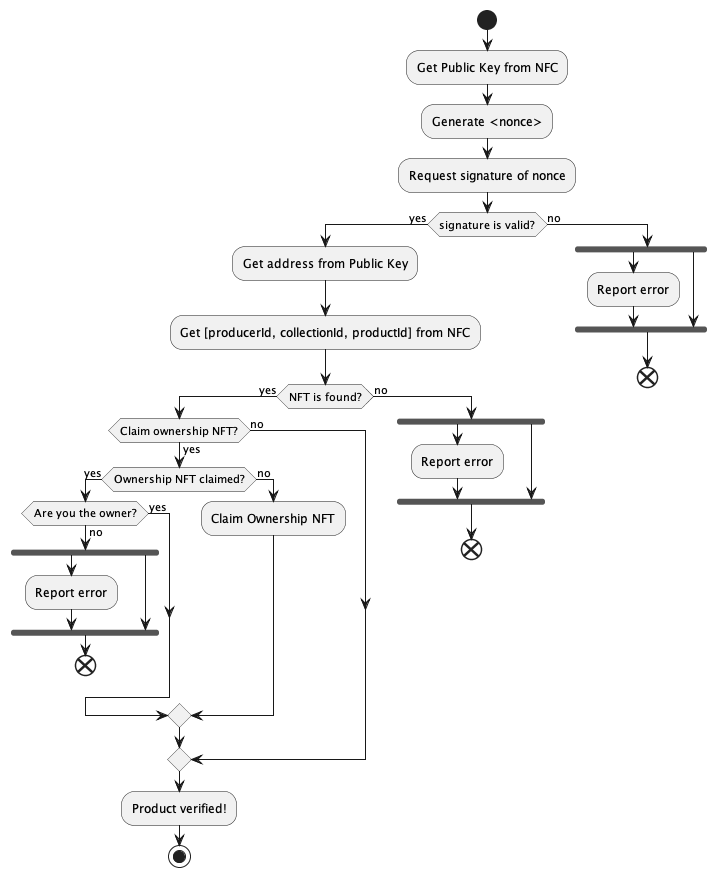

# Mobile App

L'applicazione mobile sarà il punto di accesso per l'utente finale per verificare l'autenticità e l'originalità di un prodotto.

Per verificare un prodotto l'utente dovrà solamente premere il pulsante di verifica e avvicinare il proprio smartphone al chip NFC presente sul prodotto.

## Workflow

Quello che avviene nell'applicazione mobile durante lo scansionamento è descritto nel seguente diagramma:

    

## Mockup Grafico

Il mockup grafico dell'applicazione può essere visualizzato [qui](https://www.figma.com/file/pfKjegMWyvKefAlKYeGRi9/Radix?type=design&node-id=0%3A1&mode=design&t=Fq0trQShQRQt8ie3-1) e il prototipo interattivo può essere visualizzato [qui](https://www.figma.com/proto/pfKjegMWyvKefAlKYeGRi9/Radix?type=design&node-id=1-115&t=UXcKAo1JpIvFimpy-1&scaling=scale-down&page-id=0%3A1&starting-point-node-id=1%3A115&mode=design) (premere in qualsiasi punto della schermata per iniziare l'interazione).

Il prototipo interattivo mostra i seguenti scenari in ordine:

- Scansione di un prodotto autentico
- Riscatto di un NFT di proprietà
- Scansione di un prodotto verificato, già riscattato dall'utente
- Scansione di un prodotto verificato, già riscattato da un altro utente
- Scansione di un prodotto non autentico

[< back](./smart_contract.md) |