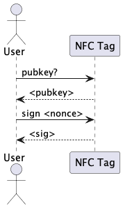

# Chip NFC

Il chip NFC è un componente hardware che permette di rendere un prodotto unico e inimitabile.

## Come funziona

Il chip sarà composto da un antenna NFC e da un microcontrollore che sarà in grado di calcolare algoritmi crittografici e di conservare in modo sicuro una chiave privata.

Gli algoritmi crittografici usati saranno gli stessi usati da qualunque blockchain compatibile EVM per la firma digitale, ovvero ECDSA con la curva secp256k1. (Si possono trovare più informazioni su ECDSA [qui](https://en.wikipedia.org/wiki/Elliptic_Curve_Digital_Signature_Algorithm))

## Autenticazione

Il chip potrà essere autenticato attraverso un meccanismo di CRA (Challenge-Response Authentication) asimmetrico.

   

L'utente chiederà al chip di calcolare la chiave pubblica associata alla chiave privata, il chip risponderà con la chiave pubblica.

Successivamente l'utente invierà una challenge (un numero casuale) al chip, il chip firmerà la challenge con la chiave privata e invierà la firma all'utente.

L'utente potrà verificare la firma con la chiave pubblica precedentemente ricevuta.

## Indirizzo Blockchain

Per risalire all'indirizzo pubblico associato al chip, si dovrà calcolare l'indirizzo a partire dalla chiave pubblica.

Questo può essere fatto calcolando l'hash della chiave pubblica (keccak256) e prendendo gli ultimi 20 byte.

[< back](../README.md) | [next >](./smart_contract.md)