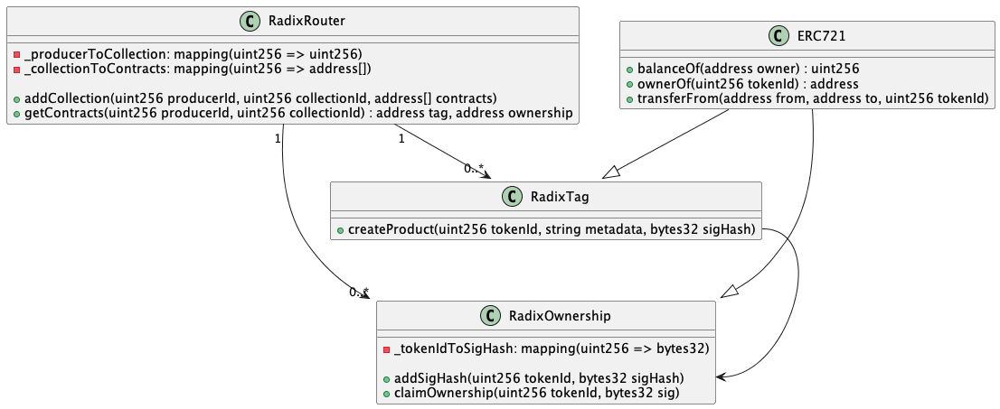

# Smart Contracts

Gli smart contracts sono programmi che vengono eseguiti sulla blockchain.

## Architettura Smart Contract

    

L'architettura degli smart contract è composta da tre contratti principali:

- `RadixTag`
- `RadixOwnership`
- `RadixRouter`

La struttura permettera di creare i certificati NFT da associare ai prodotti, di generare per ogni prodotto un NFT che attesta la proprietà di esso che potrà essere riscattato solo da chi possiede il prodotto fisico.

### RadixTag

`RadixTag` è il contratto che gestisce i tag NFC. Estende `ERC721` che fornisce le funzionalità di base per la gestione dei token non fungibili.

Il contratto implementa le funzionalità per creare un nuovo tag e associarlo a un prodotto.

Per creare un nuovo tag sarà necessario fornire anche una `sigHash` (signature hash) che sarà utilizzata per garantire solo a chi possiede il tag di poter riscattare l'NFT di proprietà in seguito. `sigHash` è l'hash della firma prodotta dal chip facendogli firmare una sequenza di byte pubblicamente conosciuta.

### RadixOwnership

`RadixOwnership` è il contratto che gestisce la proprietà dei prodotti. Estende `ERC721` che fornisce le funzionalità di base per la gestione dei token non fungibili.

Il contratto implementa le funzionalità per riscattare l'NFT di proprietà di un prodotto. Per riscattare l'NFT sarà necessario fornire la `sig` (signature) prodotta dal chip facendogli firmare la sequenza di byte pubblicamente conosciuta.

### RadixRouter

`RadixRouter` è il contratto che tiene traccia dei vari contratti di tag e ownership esistenti di ogni azienda produttrice che utilizza Radix. La sua funzione principale è quella di instradare le chiamate ai contratti giusti.

[< back](./nfc_chip.md) | [next >](./mobile_app.md)